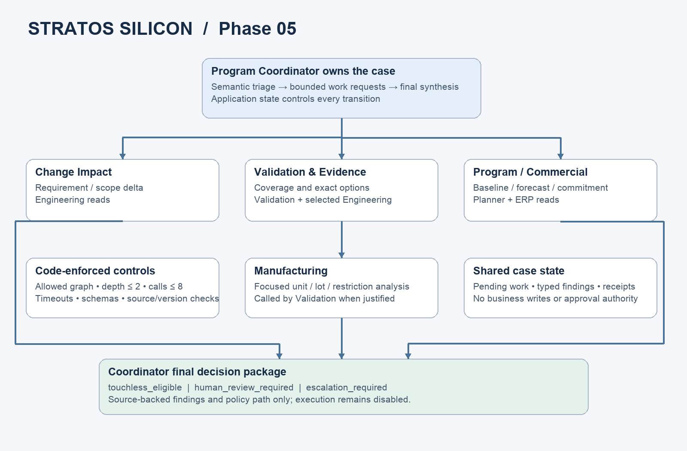
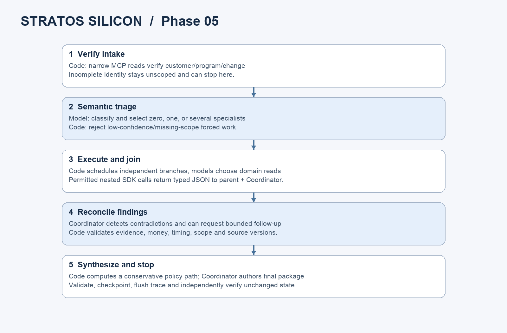

# Phase 05 — Stratos coordinator-led multi-agent harness

Current follow-on: [Phase 06 Human Approval & Execution](HUMAN_APPROVAL_EXECUTION_HANDOFF.md)
is now implemented and offline-verified. The phase-specific claims below describe
the historical baseline; its agents and analysis contracts remain unchanged.

The later [workflow compatibility handoff](WORKFLOW_COMPATIBILITY_HANDOFF.md)
documents additive case/run linkage, the registry/service boundary and host-only
proposal contracts. The live results below remain the historical Phase 05 results;
this compatibility update did not rerun live models or implement Phase 06 execution.

**Status: PASS for the three demonstrated scenarios.** All use real GPT-6 Astra
through the same Coordinator entry point. The final offline suite has 137 passing
tests, and 377 existing regression tests passed. No business mutation or approval
was executed. Five unsuccessful development attempts are retained alongside the
three accepted runs; this is not evidence of statistical production reliability.

The new runtime lives in `src/program_coordinator/`, with an isolated Python 3.12
environment and lockfile in `coordinator/`. It preserves the original
`src/program_investigator/` implementation and its existing artifacts. The backend,
enterprise client, MCP server, five UIs, root dependency configuration and business
authorization handlers are unchanged. This workspace has no Git metadata.

The user's [Phase 05 request](../prompts/05_MULTI_AGENT_HARNESS.md) supersedes the
historical foundation-only phase restrictions. No Phase 06 write tools, approval
execution, control-plane UI, model routing, remote hosting or additional agent
framework has been introduced.

## 1. Architecture and ownership



```text
ProgramChangeEvent
  → host intake checks and narrow identity/request MCP reads
  → Program Coordinator semantic TriageDecision
  → code-admitted specialist work, parallel when independent
      → Change Impact
      → Validation & Evidence → Manufacturing when justified
      → Program / Commercial
  → Coordinator reconciliation and bounded additional work
  → deterministic conservative policy determination
  → Coordinator FinalDecisionPackage → source/schema validation → stop

Every business read: SDK MCP session → existing Streamable HTTP MCP
                  → existing EnterpriseClient → existing HTTP API → SQLite
```

Each specialist uses an SDK `Agent` and `Runner.run`. Nested collaboration is an
SDK `function_tool` that invokes a bounded child SDK run and returns validated
typed JSON. It does not transfer ownership. Code dispatches the Coordinator's
typed work list, rather than exposing an unrestricted delegation tool. Only the
Coordinator can produce the final package, and only application code can accept
that package or complete the local case state. Completing a case analysis does
not close an enterprise change record.

## 2. Coordinator role

`agents.py` contains the common instructions, manager instructions and four
specialist instruction blocks. The Coordinator has three structured phases:
triage, reconciliation and synthesis. It chooses the supported semantic category,
confidence, missing information, needed expertise, questions, reasons and actual
dependencies. It can choose zero, one or several specialists. It normally delegates
deep source analysis and synthesizes typed findings instead of repeating reads.

Triage is provisional. The final Coordinator may refine a supported semantic
category after evidence arrives, but cannot widen customer/program scope, bypass
the deterministic policy path or broaden the administrative touchless rule.
Unknown final categories require escalation. Classification alone grants nothing.

The bounded taxonomy includes validation requirements, workload profiles,
runtime/firmware, power/thermal, performance acceptance, manufacturing constraints,
program schedules, customer acceptance, administrative evidence references and
other/unknown. No runtime branch tests for CR-017 or CR-018.

## 3. Specialist responsibilities and outputs

| Role | Authoritative domain task | Explicit boundaries |
|---|---|---|
| Change Impact | Compare exact requirement revisions, workload/configuration and affected scope; preserve approved/requested states | Does not decide evidence sufficiency or select/approve an option |
| Validation & Evidence | Use deterministic coverage/options; preserve all evidence and mismatch reasons, eligibility flags, integer-cent costs and timing | Does not invent criteria, independently override eligibility, approve or claim a new pass |
| Program / Commercial | Establish milestones, dependencies, owners, approved rates and customer order commitments | Keeps baseline, internal forecast and external commitment distinct; invents no revenue or savings |
| Manufacturing | Read requested units and referenced lots, restrictions, refresh times and hold/release conditions | Cannot release a hold, alter routes, diagnose physical root cause or infer yield |

Specialist output contracts are separately instantiable and independently tested.
`build_agent(role)` is a public factory; `CaseHarness` accepts an injected SDK model
and runner for focused offline evaluation. Test data and expectations live outside
the runtime under `coordinator/tests/` and `coordinator/evals/`.

## 4. Exact MCP tool-access matrix

These allowlists are enforced during SDK discovery **and** call execution. All
tools require read-only, non-destructive, idempotent, closed-world annotations.
Missing expected tools fail discovery. Unknown and write tools are filtered out.

| Role | Allowed tools |
|---|---|
| Coordinator intake host | `get_change_request`, `get_program`, `get_document`, `get_documents` |
| Change Impact | `get_change_request`, `get_requirement_revision`, `get_configuration`, `get_workload_profile`, `get_document`, `get_program`, `get_program_milestone` |
| Validation & Evidence | `get_validation_coverage`, `get_validation_options`, `get_validation_result`, `get_validation_samples`, `get_validation_jobs`, `get_validation_job`, `get_requirement_revision`, `get_configuration`, `get_workload_profile`, `get_procedure`, `get_acceptance_criteria`, `get_policy`, `get_document` |
| Program / Commercial | `get_program`, `get_program_milestone`, `get_dependencies`, `get_implementation_links`, `get_customer_order`, `get_cost_rates`, `get_change_request` |
| Manufacturing | `get_manufacturing_unit`, `get_manufacturing_lot`, `get_validation_samples` |

Coordinator model calls have no direct MCP attachment: the host gives them only
verified intake context and typed specialist results. The four high-level reads
are the capability ceiling of the host's Coordinator intake session. Each
specialist gets its own SDK MCP session and only its own matrix subset.

Validation receives resource IDs and deterministic restrictions through its option
tool; dedicated manufacturing source reads are reserved for Manufacturing.
Program receives approved rate inputs from ERP; combining option forecasts with
commitments happens in Coordinator synthesis. This is least privilege at the
available **tool** granularity: existing aggregates can legitimately embed fields
owned by other systems. It is not field-level information-flow isolation.

## 5. Allowed collaboration graph

| Caller | Permitted specialists |
|---|---|
| Coordinator | Change Impact; Validation & Evidence; Program / Commercial; Manufacturing |
| Change Impact | Validation & Evidence; Program / Commercial |
| Validation & Evidence | Manufacturing; Program / Commercial |
| Program / Commercial | Change Impact |
| Manufacturing | None |

The graph contains a possible static Change↔Program pair, but a running call
cannot revisit any ancestor. Depth is measured with a root specialist at depth 1.
Repeated identical requests are blocked after normalizing question whitespace/case
and sorting focus IDs. A request for an already-running sibling returns a typed
`already_running` receipt immediately; it never waits on a sibling and creates a
cross-branch deadlock. Every nested result is stored centrally and returned to its
parent as typed JSON. Both completed and failed invocation records remain visible.

## 6. Model decisions versus code controls

| Model-driven | Code-driven |
|---|---|
| Semantic classification, confidence and missing-information interpretation | Event schema, fixed MCP scope verification, structured-output validation |
| Needed expertise and justified dependency edges | Allowed graph, ancestry checks, duplicate suppression, admission budgets |
| Domain evidence interpretation and justified nested consultation | MCP tool allowlists, record-type/ID checks, response/receipt/scope verification |
| Reconciliation, additional questions and final synthesis | Wave scheduling/joining, timeouts, retries, case-state transitions |
| Recommended next step | Deterministic policy ceiling and execution always disabled |

Structured work-request schemas constrain focus IDs to the already verified set;
the model cannot use a document's incidental prose to introduce unverified IDs as
delegation metadata. Runtime checks independently enforce the same restriction.

## 7. Application-owned state

`CaseState` includes a generated case ID, correlation ID, generic input event,
customer/program scope, verification status, triage, invocation ledger, completed
typed assessments, pending work, source/version references, guardrail events,
unresolved questions, policy decision, final-package status and termination reason.
It also retains typed Coordinator reviews, source-backed question resolutions and
explicit blocking issues. An unresolved engineering question for the next human
review is distinct from missing/conflicting context that blocks today's analysis.

The legal stage transitions are:

```text
intake → triage → specialists → reconcile → synthesis → completed
                  ↑             |
                  └─────────────┘  bounded additional work
triage → synthesis                 zero-specialist path
any active stage → terminated      explicit failure or limit
```

Code persists owner-only `case-state.json` checkpoints using atomic replacement in
a unique run directory. State does not live solely in conversation history. Work
waves are admitted before launch and failed admission cannot strand pending work.
Cancellation joins/cancels all started tasks and records their state. Checkpoints
are inspectable local records; automatic crash recovery/resume is not implemented.

## 8. Guardrails and evidence handling

- Input: strict generic event schema; valid IDs; explicit UTC timestamps; supported
  source-system names; nonempty request; required scope; exact customer/program
  pairing verified through MCP/source APIs; unresolved linked IDs remain flagged.
- Tools: independent read allowlists; discovery annotation checks; loopback URLs;
  no proxy/redirect inheritance or OpenAI key in MCP; only discovered IDs of the
  required record type. Mistyped reads return local structured corrective feedback,
  without requesting the wrong record from the enterprise API.
- Responses: validate success/error envelope, exact requested identity, recursive
  customer/program scope, source record/version metadata and GET correlation
  receipts before giving data to the model. Detected source-version changes during
  a case fail closed; there is no cross-system snapshot guarantee.
- Findings: citations must refer to receipts actually available to that agent.
  Fact findings contain exact JSON-pointer/value assertions, checked against original
  MCP data. Versioned projections such as dependencies preserve milestone identity
  and record version. Source bodies, versions and hashes are retained locally.
- Domain outputs: coverage and every evidence item/mismatch must match the tool;
  all option pairs and numeric/eligibility/timing fields must match exactly;
  commercial milestone/order fields and manufacturing unit/lot restrictions must
  match source records. Omitted required evidence/options/provenance are rejected.
- Final output: must identify every completed specialist, retain evidence gaps,
  preserve exactly the available eligible options and host unresolved questions,
  match scope and policy, and declare no business actions/approvals/new pass/customer
  acceptance. Consequential-claim language checks add defense in depth.
- Reconciliation: resolving a specialist question requires the exact original
  question and checked source-pointer assertions. Resolved questions are removed
  from the final open-question list while the original specialist report and
  resolution remain preserved. Explicit conflicts, missing intake and failed work
  still escalate; administrative touchless handling permits no unresolved question.

These controls do not prove every natural-language sentence. A correct citation
does not automatically entail all associated prose; inference and business review
remain necessary. Semantic guardrails supplement the source systems, which remain
the authoritative permission boundary.

## 9. Execution limits

| Control | Default |
|---|---:|
| Total Coordinator model turns across phases | 10 |
| Model turns per specialist invocation | 12 |
| Total specialist invocations, including nested/follow-up | 8 |
| Delegation depth | 2 |
| Reconciliation rounds that may request more work | 1 |
| Total attempted MCP tool calls | 80 |
| MCP/tool call timeout | 45 seconds |
| Specialist invocation timeout, including nested work | 300 seconds |
| Whole-case deadline | 900 seconds |
| Model HTTP timeout / connect | 180 / 10 seconds |
| OpenAI SDK retry ceiling | 1 retry |
| Additional MCP-layer retries | 0 |
| Existing enterprise GET retries | Up to 2 |
| Per-generation output cap | 14,000 tokens |

All models are `gpt-6-astra`, medium reasoning, Responses API, `store=False`.
No model routing exists. Limits are configuration fields with hard upper bounds.
No loop can silently restart the entire workflow. Missing/failed required work
prevents a successful business recommendation; limits/termination have fixed safe
codes in state and reports. Transport exception prose is never logged.

## 10. Structured contracts

`ProgramChangeEvent` contains event/change/customer/program IDs, source system,
optional change-type hint, priority, requester, received-at UTC, request summary,
linked record IDs and correlation ID. Missing business identity is representable
for clarification; malformed syntax is rejected before model work.

The main outputs are `TriageDecision`, `ChangeImpactAssessment`,
`ValidationEvidenceAssessment`, `ProgramCommercialAssessment`,
`ManufacturingAssessment` and `FinalDecisionPackage`. Supporting contracts include
`CoordinatorReview`, `WorkRequest`, `ConsultationReceipt`, `SourceReference`,
`SourceFact`, `Finding`, `PolicyDecision`, `Invocation` and `CaseState`.

Final packages include case/scope IDs, final classification, change summary,
affected scope, specialist synopses, confirmed facts, evidence gaps, eligible
available options, constraints, program impacts, risks, unresolved questions,
recommended next step, policy/review/escalation fields and versioned references.
Full ineligible alternatives remain in the Validation assessment attached to state.

## 11. Parallelism

The Coordinator marks only genuine dependencies in `depends_on`. Code validates
the dependency DAG and starts each ready wave with `asyncio` tasks, then joins it.
Independent domain identifiers allow concurrent requirement comparison, deterministic
coverage/options reads and baseline/forecast/commitment reads. Option-specific
schedule synthesis does not require delaying the initial Program source inventory.

Models can request nested expertise as new facts emerge. Validation's manufacture
restriction query can run while other root specialists finish. The application
records root-wave membership, start/end times and parent invocation IDs. Offline
tests use concurrent task counters rather than assuming parallelism from
a diagram or from model text. Dependent waves are tested to remain sequential.



## 12. Live scenarios and results

Runs completed on 2026-09-11 UTC. The scenario driver invokes the same
`program_coordinator` entry point, using real GPT-6 Astra, real Streamable HTTP MCP
and real Stratos HTTP APIs. Expected answers exist only in the independent driver,
never in agent context. All three saved results also passed current-code schema,
source, policy and fresh-HTTP revalidation without further paid model calls.

Scenario A is the narrowly authorized administrative internal evidence packet
documented in [SCENARIO.md](SCENARIO.md). Scenario B is unchanged CR-017. Scenario C
is an incomplete event with no invented enterprise record. Touchless eligibility
does not authorize business writes in this phase or create engineer approval.

| Scenario | Actual triage | Specialist behavior | Final path | Current scripted checks |
|---|---|---|---|---|
| A: CR-018 | `administrative_evidence_reference`, confidence 0.99 | Validation only; existing coverage; no scheduling-options call | `touchless_eligible` | 18/18 |
| B: CR-017 | `workload_profile_change`, confidence 0.93 | Change, Validation and Program concurrently; Validation dynamically called Manufacturing | `human_review_required` | 22/22 |
| C: incomplete request | `other_or_unknown`, confidence 0.40 | Zero specialists and zero source reads; six explicit intake questions | `escalation_required` | 18/18 |

Actual typed packages are available for [A](multi_agent/touchless-decision.json),
[B](multi_agent/human_review-decision.json) and
[C](multi_agent/escalation-decision.json). The
[machine-readable report](multi_agent/run-results.json) contains all attempts,
complete metrics, invocation reasons, verification outcomes and local artifact paths.

Trace IDs, also used as `.cache/multi-agent/<trace_id>/` directory names:

- A: `trace_fc9e4c28b9a748208a4bd5473a081fc0`
- B: `trace_b10820d32c3544e9b2e11b4f567a4ed2`
- C: `trace_35bc365281be45d384e24e8a211aa345`

In B, the three root branches started within 16 ms of each other. Validation
requested Manufacturing at depth 2 after the options source excluded SAMPLE-B-018
for a manufacturing restriction. The completed child assessment returned to
Validation and the central case. All four assessments appear in the final package.
No second root wave was necessary. C stopped deep investigation at triage rather
than inventing scope or record IDs.

CR-017 checks confirm the approved-to-requested requirement delta, unchanged
CFG-B-01, different workload bins and 120-to-480 suite minutes. The full nine-pair
option analysis preserves wrong-evidence reasons, qualifications and manufacturing
exclusions. The final package contains the one eligible deadline-meeting pair:
SLOT-PRIORITY / SAMPLE-B-017, **180000 USD cents**, prospective review readiness
**2026-11-18T20:00:00Z**, and **1320 minutes** deadline slack. This is a conditional
option for human review, not a selected job, validation pass or changed commitment.
The manufacturing hold remains administrative traceability disposition, not a
diagnosed hardware failure. Unknown future results remain explicit risks. The
criteria source explicitly omits numerical thresholds in this phase; the recorded
Coordinator review resolves that source-availability question as a known limitation,
without claiming an independent threshold comparison.

No business rows changed during any agent attempt. Every accepted run also retained
an identical complete persisted-state fingerprint before and after. One initial
failed B attempt made a mistyped GET that returned NOT_FOUND, adding an expected
denial audit row and advancing its SQLite sequence. That happened while the first
A attempt was also running, so that A fingerprint check correctly reported change.
The independent proof in `source_denial_audit_proof` reconstructs the initial hash
by virtually omitting only that audit INSERT and reversing only its sequence
increment. It did not edit the database. The input record-type guard now catches
that error locally. Subsequent runs and final readbacks left even audit state unchanged.

Development attempts are preserved rather than silently replaced:

| Attempt / trace prefix | Actual outcome | Correction before the next relevant run |
|---|---|---|
| C1 / `35bc3652` | PASS | None |
| A1 / `3cdc16a5` | Complete but escalated; taxonomy lacked the administrative class | Added the bounded administrative class; eligibility still depends on source policy and evidence |
| B1 / `c0d07a64` | Failed dependency after a mistyped document read | Enforced per-parameter discovered record types with local corrective feedback; clarified independent-work instructions |
| A2 / `fc9e4c28` | PASS | None |
| B2 / `3556a4c9` | Rejected a valid dependency projection and later a semantic classification refinement | Fixed projection identity/version handling; allowed supported classification refinement while retaining scope/policy ceilings |
| B3 / `611e1d34` | Rejected focus IDs found only in document prose before work launched | Constrained work schemas to verified IDs; made wave admission atomic |
| B4 / `184be935` | All domain/source checks passed; overly conservative escalation | Separated source-checked question resolutions, nonblocking review questions and actual analysis blockers |
| B5 / `b10820d3` | PASS | None |

Each runtime correction received offline regression coverage. The final review also
ensured specialist questions are collected before policy even with zero configured
reconciliation rounds, and that resolved questions are not reintroduced. The three
saved live outputs passed revalidation against the final code. No paid repeat was
made solely to retest unchanged successful behavior.

## 13. Baseline comparison methodology

The comparison uses the preserved verified single-agent assessment at
`trace_ef4ecc86847c44bb9db87174587f28a7`. It needed offline citation normalization
after its original live process rejected a valid namespace/projection citation.
Its original report remains failed; its separate revalidation and 17-check business
verification record acceptance. It is not relabeled as a clean first-run success.

Baseline: 5 successful-assessment model calls, 25 MCP calls, 53 HTTP GETs, 17 unique
tools, 106.614 seconds, 84,348 input / 7,378 output / 62,768 cached-input tokens.
There were two baseline live attempts overall. No extra paid baseline run was made.
The Phase 05 source extension adds administrative records without changing CR-017's
coverage, nine options, commercial facts or manufacturing restrictions.

| CR-017 measurement | Preserved ProgramInvestigator | Accepted multi-agent run |
|---|---:|---:|
| Completed model turns/calls | 5 | 19 |
| Coordinator / specialist model turns | Single agent: 5 | 3 / 16 |
| Specialist invocations | 0 | 4 |
| MCP calls / HTTP GETs | 25 / 53 | 28 / 57 |
| Distinct tools used | 17 | 19 |
| Source systems represented | 5 | 5 |
| Distinct versioned source records in response bodies | 37 | 33 |
| Wall-clock seconds | 106.614 | 175.546 |
| Input / output tokens | 84,348 / 7,378 | 153,428 / 18,153 |
| Cached-input tokens, included in input | 62,768 | 93,807 |
| Total tokens | 91,726 | 171,581 |
| Estimated token cost | $0.647468 | $1.597667 |

Both accepted assessments passed their business checks for evidence gaps, option
eligibility, cost, timing and constraints. Multi-agent final output additionally
includes the typed policy path, four specialist summaries and application-owned
case/delegation state. Both retain baseline, forecast and commitment distinctions.
Record coverage counts deduplicate `(owning_system, id)` objects in tool response
bodies; aggregates, extra job reads and repeated copies explain differences. A
larger count does not mean better evidence. Both cover the relevant five systems.

The multi-agent run took **1.65×** as long, used **1.87×** total tokens and had
**2.47×** the estimated token cost. Parallel specialists reduced serialization of
their independent work, but Coordinator phases and richer typed reports added work.
Per-domain traces, tool ceilings, schema factories and separate behavioral tests
improve inspection, modularity and evaluation isolation. A semantic reliability
advantage is **not established**: implementation defects caused several rejected
development runs, and only one accepted run per scenario was retained.

This is a small historical comparison, not a randomized benchmark or a claim that
multi-agent is automatically more accurate, faster or cheaper. Different prompt
and output contracts, source inventories, cache state and live timing are confounders.
Specialization clearly narrows tool access and separates domain tests/traces; a
reliability or cost advantage requires larger evaluations in Phase 07.

## 14. Tracing and safe observability

An explicit SDK trace spans intake, Coordinator phases, root branches, nested
specialists, MCP calls, guardrails and validation. The same trace ID and case/event
correlation are passed through run configuration and custom spans. Nested model
calls inherit the parent's span context. Safe hooks record role, invocation ID,
request/response IDs, latency and token metadata per generation.

MCP metadata carries case/correlation/trace/invocation IDs as non-authorizing
context. The existing MCP server retains its own generated correlation IDs. Local
receipts and custom spans map application IDs to MCP call/correlation IDs and on
to enterprise HTTP request IDs and matching correlation echoes. This is a recorded
join across IDs, not a claim that the backend trusts inbound case metadata.

`trace_include_sensitive_data=False` excludes model/tool payloads from exported
SDK spans. The baseline's sanitizing processor clears inputs/outputs and replaces
exception messages before the SDK exporter. Structured synthetic assessments stay
in local artifacts; trace spans record their schema/validation outcome. No private
model reasoning or plaintext credential is saved. Traces are flushed on exit.

Inspect workflow **Stratos Program Coordinator** in the
[OpenAI Platform Traces dashboard](https://platform.openai.com/traces), using the
configured key's project and the exact trace IDs below. Local export flushes are
verified; visibility in the authenticated Platform UI was not independently checked.

## 15. Commands, tests and actual verification

Installation and run commands are in [coordinator/README.md](../coordinator/README.md).
The live test sources used `.cache/multi-agent-demo/phase05-v1/enterprise.sqlite3`,
backend `127.0.0.1:9011` and MCP `127.0.0.1:9010/mcp`, scoped server-side to
CUST-FML01 / PRG-A17 with the existing public mock reader selector. The user's
existing databases and earlier services were not reset or replaced.
The temporary 9010/9011 test services were stopped after final verification;
the database and artifacts remain available. Restart with the documented
`--serve-existing` command when needed.

Commands actually used include:

```sh
UV_CACHE_DIR="$PWD/.cache/uv" uv sync --project coordinator \
  --python "$PWD/.venv/bin/python" --no-python-downloads
TMPDIR="$PWD/.cache/tmp" coordinator/.venv/bin/python -m pytest \
  -c coordinator/pyproject.toml coordinator/tests -q --tb=short
TMPDIR="$PWD/.cache/tmp" .venv/bin/python -m pytest -q \
  tests runtime_checks/test_openai_connection.py --tb=short
TMPDIR="$PWD/.cache/tmp" mcp_server/.venv/bin/python -m pytest \
  -c mcp_server/pyproject.toml mcp_server/tests -q --tb=short
TMPDIR="$PWD/.cache/tmp" investigator/.venv/bin/python -m pytest \
  -c investigator/pyproject.toml investigator/tests -q --tb=short
PYTHONPATH=src:. coordinator/.venv/bin/python coordinator/evals/run_scenarios.py \
  --scenario escalation --storage "$PWD/.cache/multi-agent-demo/phase05-v1"
# Same command with --scenario touchless and --scenario human_review.
```

Actual results: **137 Coordinator tests passed** (final run: 1.18 seconds),
**282 backend/runtime tests passed** (46.63 seconds), **56 MCP tests passed**
(10.78 seconds) and **39 ProgramInvestigator tests passed** (1.33 seconds):
**514 passing tests total**. No frontend code changed; browser/UI tests were not rerun.
The offline harness suite covers five agents, schemas, least privilege, the graph,
depth/cycles/duplicates/call limits, state transitions, root and nested parallelism,
dependencies, malformed outputs, missing/failed work, cancellation/timeouts, scoped
IDs, immutable source facts, policy ceilings and final completeness.

Independent live verification replays each successful MCP read through fresh HTTP
and compares the exact body. Developer-only SQLite fingerprints include all
persisted tables, metadata, audit and idempotency records. These checks are not
available to agents and never become business evidence or mock human approval.

Other completed checks: locked environment installation and `uv pip check`
(46 installed packages), Python compilation, SDK strict-schema construction for all
roles/phases, and SHA256 comparison of 12 preserved baseline source/environment
files with no changes. Architecture and sequence PNGs were rendered and visually
inspected. The diagrams use a temporary Pillow environment, not a runtime dependency.
The final recorded-output rechecks use `--verify-run <directory>` on the same
scenario driver; they invoke no model. `python3 coordinator/evals/build_report.py`
produces the durable report and decision copies from existing artifacts.

## 16. Metrics and cost interpretation

Reports distinguish completed generations, HTTP attempts, Coordinator turns,
specialist invocations, MCP attempts/successful calls, underlying HTTP reads,
parallel branches, nested requests, usage and wall-clock latency. Failed attempts
remain included in total development usage. Reported tokens cover completed model
responses only; an interrupted request can have unreported billable usage.

Any USD estimate uses published token prices and observed cached/input/output
tokens, not an invoice. It excludes unreported requests and account-specific
adjustments. No fabricated savings or business revenue impact is reported.

| Accepted run | Model calls | Specialists | MCP / GETs | Seconds | Input | Output | Cached input | Estimated USD |
|---|---:|---:|---:|---:|---:|---:|---:|---:|
| A: touchless | 5 | 1 | 9 / 18 | 73.564 | 24,282 | 4,339 | 4,493 | $0.419333 |
| B: human review | 19 | 4 | 28 / 57 | 175.546 | 153,428 | 18,153 | 93,807 | $1.597667 |
| C: escalation | 2 | 0 | 0 / 0 | 27.443 | 4,074 | 1,313 | 0 | $0.106390 |

All **eight Phase 05 live attempts**, including failures: **74 completed model
calls**, **528,778 input**, **69,627 output**, **598,405 total tokens**, with
**300,635 cached-input tokens** included in input. Estimated total: **$6.063415**.
The three accepted runs account for $2.123390 of that estimate. The historical
single-agent comparison is separate and adds no paid call during this phase.

The estimate uses the published GPT-6 Astra standard short-context text prices:
$10 per million uncached input tokens, $1 per million cached input tokens and
$50 per million output tokens. Each recorded request stayed below 272K input
tokens. Reasoning tokens are already included in output and are not double-counted.
Latencies include the local workflow and export flush, not just model inference.
Nested specialist durations overlap parent durations and must not be summed into
wall time. The complete report retains per-generation and per-invocation links.

## 17. Limitations

- Local synthetic mock identities and source policies are not production auth,
  verified real people, real engineering decisions or real customer evidence.
- The only touchless rule demonstrated is preparation of an internal existing-
  evidence packet. No autonomous scheduling rule was added.
- Context and source DTOs deliberately match the current limited source contracts.
  Unsupported categories or missing domain inputs require clarification/review;
  this is not a universal semiconductor impact engine.
- Tests establish specific controls and the recorded scenarios, not universal
  semantic accuracy or freedom from prompt injection. Free prose still needs review.
- Case checkpoints support inspection, not automatic resumption or a durable
  distributed work queue. There is one application-owned process per CLI case.
- Source-version changes fail closed; there is no distributed snapshot transaction.
  A later execution phase must revalidate all critical versions and authorization.
- Official trace export is configured and flushed; authenticated dashboard visibility
  and invoice reconciliation were not checked.
- No full Phase 07 eval service, repeated statistical quality benchmark, model
  routing, hosted deployment or control-plane UI was built.

## 18. Phase 06 boundary

Phase 06 may add a review surface, actual role-authorized approval bound to an
immutable plan/version/scope/source snapshot, and narrowly authorized execution
with idempotency, optimistic concurrency, source revalidation and per-system
transactions. The current final package is analysis, not an approval token or
execution credential. Existing API authorization remains the boundary.

## Official implementation references

Checked current official guidance and installed SDK behavior during this build:
[Agents SDK overview](https://developers.openai.com/api/docs/guides/agents),
[manager orchestration](https://developers.openai.com/api/docs/guides/agents/orchestration),
[agent workflow evaluation](https://developers.openai.com/api/docs/guides/agent-evals),
and [GPT-6 Astra](https://developers.openai.com/api/docs/models/gpt-6-astra).
The manager pattern preserves final ownership while specialist tools perform
bounded work. No model compatibility issue required substituting Astra.
The isolated lockfile pins openai-agents 0.22.2, openai 3.13.0 and MCP 2.2.0.
