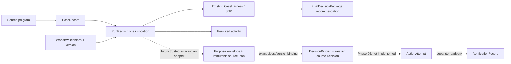

# Workflow compatibility update — before Phase 06 execution

Current follow-on: [Phase 06 Human Approval & Execution](HUMAN_APPROVAL_EXECUTION_HANDOFF.md)
is now implemented and offline-verified. The phase-specific claims below describe
the historical baseline; its agents and analysis contracts remain unchanged.

This is an additive, offline-verified compatibility update in the existing
repository. **Phase 06 execution and Phase 08 are not complete.** No source-system
API, agent tool permission, scenario, business fixture, five-app UI source, package
dependency or single-agent baseline was changed.

## 1. Baseline found

Confirmed from code, not roadmap text:

- `CaseHarness` owns one bounded SDK investigation, including semantic triage,
  parallel specialists, permitted nested collaboration, reconciliation and typed
  `FinalDecisionPackage`. Each invocation previously generated a fresh `case_id`.
- Its JSON `CaseState` checkpoints and per-trace artifacts are persisted under
  `.cache/multi-agent/`. They are one-run investigation state, not a reusable case
  directory. No SDK approval interruption, durable session resume or write executor
  existed. The original ProgramInvestigator remains separate and unchanged.
- The five source applications already have immutable Engineering `Plan`, separate
  `PlanState` and `Decision`, Validation job/reservation, Planner link/task, audit
  and idempotency records. Their four POSTs support the manual/simulated-persona
  workflow. These source capabilities do not authorize agent write tools.
- Existing approval is bound to a server-computed plan ID/version/digest, exact
  scope, policy and critical source snapshot. Source handlers enforce signer
  membership, policy, resource eligibility, source freshness, optimistic concurrency
  and per-system transactions. Booking and Planner updates are separate actions.
- There was no generic workflow registry or application-owned case/run index.
  No Phase 06 agent integration was found in source, entry points, tests or handoffs.

The directory has **no Git metadata**: `git status --short` returned “not a git
repository.” Before editing, 234 project-file hashes were recorded under
`.cache/compatibility-update/before-hashes.json`. Unrelated portfolio-enrichment
work was preserved. Baseline tests passed: 137 Coordinator, 282 backend/runtime,
56 MCP and 39 ProgramInvestigator tests. No pre-existing test failure was found.

The implementation decision was to retain the SDK loop and source authority,
extend the existing JSON persistence approach, and adapt the existing source
schemas. Open questions are confined to the future trusted human-review binding,
write adapters, SDK approval/resumption integration and post-action readback.

## 2. Actual objects and relationships



| Concept | Actual representation |
|---|---|
| Program | Existing source `program_id`/`customer_id`; no new Program class or business store |
| Case | `CaseRecord`, stable across runs, keyed by customer/program/source change |
| Workflow definition | Immutable `WorkflowDefinition` metadata, definition version 1 |
| Run | `RunRecord`, separate run/invocation/trace IDs, exact definition version and trigger provenance |
| SDK investigation state | Existing `CaseState`; additive optional `run_id`, `workflow_id`, `workflow_definition_version` |
| Recommendation | Existing `FinalDecisionPackage`, retained on the run; never treated as approval |
| Proposal | Host-only `Proposal` envelope around the existing `mock_enterprise.schemas.Plan` |
| Decision | `DecisionBinding` referring to the exact envelope plus the unchanged source `Decision` |
| Action attempt | Separate `ActionAttempt`, reusing existing `JobInput`/`LinkInput` request schemas |
| Verification | Separate `VerificationRecord`, limited to job scheduling or Planner-link observations |
| Activity | Small structured `ActivityRecord` list with program/case/run and trace linkage |

No source schema was renamed or modified. The only source imports in the host
contracts are pure Pydantic schemas; no source DB, domain handler, fixture reader,
HTTP client or source mutation is reachable from these modules. They are not agent
tools and are never injected into model context.

Existing checkpoints without the three new optional linkage fields still load.
Historical traces are not silently imported, reclassified or rewritten. New cases
with an incomplete change ID use the input event ID as their intake key and retain
unverified scope. They can produce an escalation package without inventing source
identity. A later clarification/merge workflow is outside this update.

## 3. Registry and capability/permission matrix

`program_coordinator.application.registry.list_workflows()` returns the three
definitions. `dispatch_error(id, version, operation)` rejects unknown IDs, unsupported
versions, illustrative definitions and unavailable operations before dispatch.

| Workflow | Implemented operations | Actual execution mode | Actual tools | Approval/execution |
|---|---|---|---|---|
| `requirement_change_analysis` v1 | `analyze` | Existing live SDK read-only analysis; deterministic test mode recorded separately | Existing role-specific `TOOL_MATRIX`, unchanged | Analysis needs scoped reader authority. Policy path is advisory. No agent approval or execution operation. Future source scheduling/Planner actions still require exact engineer approval under the source-selected policy. |
| `yield_exception_recovery` v1 | None | Illustrative / not executable | None | No executor or action permissions; returns `WORKFLOW_NOT_IMPLEMENTED` |
| `delivery_readiness` v1 | None | Illustrative / not executable | None | No executor or action permissions; returns `WORKFLOW_NOT_IMPLEMENTED` |

Requirement-change specialists retain their existing names: `change_impact`,
`validation_evidence`, `program_commercial`, `manufacturing`. The Coordinator still
chooses zero/one/multiple specialists. The registry does not mechanically launch
these names, install tools, change the allowed graph or authorize actions. No
specialists have been assigned to the unimplemented workflows.

The catalog advertises planned capabilities separately from supported operations.
All definitions explicitly report `business_execution_available=false`.
`RunRecord.execution_mode` distinguishes `live_model` from `deterministic_test`;
`data_provenance=synthetic_source_systems` is separate. A real Astra run against
synthetic data is not labeled a simulation. This update performed no live run.

## 4. Shared invocation boundary

```python
service = WorkflowService(
    store,
    config=existing_harness_config,
    investigate=trusted_existing_harness_adapter,
    actors=host_resolved_actor_contexts,
    execution_mode="live_model",
)
result = await service.invoke(invocation, trusted_actor, trace_id=trace_id)
```

`WorkflowInvocation` contains workflow ID/version, operation, invocation ID,
customer/program, optional existing case ID, the unchanged `ProgramChangeEvent`,
and typed trigger metadata. `TrustedActor` is a separate host dependency, not a
JSON request field. The service accepts only an identity object installed by its
host, checks its scope against the invocation and configured MCP scope, and rejects
conflicting event scope before invoking the handler. The source APIs still verify
actual source membership; a newly admitted local case does not imply that source
scope has already been verified.

The host installs one existing-harness adapter. Request data cannot select a Python
callable, add tools, change MCP configuration, set a role or claim approval. The
CLI's adapter preserves its existing API client, `CaseHarness`, SDK tracing,
checkpoint callback and safe artifacts. No second agent runner or conversation
state was created. Low-level `CaseHarness` remains available for focused tests;
application callers should use the shared service.

`invoke` returns an `InvocationResult`: completed/running/failed/cancelled,
unsupported or rejected, with a stable error code, optional run and replay flag.
Malformed typed input raises validation errors; adapters should map these to their
normal invalid-input response. There is no new HTTP server.

The store atomically claims an invocation ID before agent/API setup. The same ID
and request/actor/mode return the persisted run; changed content returns
`INVOCATION_ID_CONFLICT`. Concurrent processes cannot both claim it. A new ID is a
deliberate rerun and reuses the case for the same customer/program/change. An
explicit unknown case or a case belonging to another scope/change is rejected.

The service also exposes scoped `cases`, `runs` and `timeline` reads. The latter
supports program, optional case and optional run filters.

Current CLI additions, while preserving the existing `--event` invocation:

```sh
# Offline, no credentials or tools:
PYTHONPATH=src coordinator/.venv/bin/python -m program_coordinator --list-workflows
PYTHONPATH=src coordinator/.venv/bin/python -m program_coordinator \
  --workflow-id yield_exception_recovery

# Existing paid analysis entry point, for a separately authorized future run:
PYTHONPATH=src coordinator/.venv/bin/python -m program_coordinator \
  --event coordinator/scenarios/human_review.json \
  --workflow-id requirement_change_analysis --invocation-id review-request-001
```

The illustrative command exits 2 with an explicit unsupported result. `--case-id`
selects an existing case. `--definition-version` defaults to 1. `--metadata-dir`
defaults to `.cache/multi-agent/activity`. Omitting `--invocation-id` creates a new
ID; retrying a known attempt requires its original ID. Replays preserve the original
run/trace/artifact references and do not load a key or invoke an agent.

Future manual, schedule, source-event and chat adapters must resolve identity in
trusted application code and call this same boundary. The trigger's kind/reference
is only provenance. No scheduler, event listener, chat endpoint, streaming adapter
or notification service was implemented.

## 5. Proposal and approval invariants

`proposal_from_plan` wraps an **already obtained source plan**; it does not create a
source plan or select an option. The proposal retains the existing source ID,
immutable plan version/digest, source snapshot and evidence-set digest. It adds
program/case/workflow/version/originating-run references, explicit action arguments,
supporting references, rationale, assumptions, preconditions and required policy/role.

Action arguments are exact **semantic intents derived from the immutable plan**.
Scheduling identifies the plan/version/digest, source scope, configuration, procedure,
sample, slot, cost, currency and timing. Planner intent identifies that same plan,
milestone and conditional forecast. They are not new HTTP bodies. Approval/job IDs
and the latest Planner compare-and-swap version are supplied through the unchanged
`JobInput`/`LinkInput` contracts in a future execution adapter. Scheduling precedes
Planner linking; the source `permitted_actions` list remains unchanged.

The envelope has its own SHA256 over canonical content. `validate_proposal`
recomputes both envelope and source-plan digests and checks derived actions,
policy version and source-content hashes on every use. Nested object mutation,
changed parameters, targets, evidence, assumptions, case/run or version cannot
silently reuse an old binding. Persisted proposal versions are immutable.

`DecisionBinding` extends the relationship to the exact envelope/version while
retaining the existing server-recorded `Decision`. It is **not a second approval
service**. No model or analysis path creates one. Retention does not create approval
or prove that a human reviewed the envelope. Phase 06 still needs the trusted host
review workflow that records this binding together with source decision provenance.
An old source decision alone does not prove review of the new envelope. The same
source decision ID cannot be rebound to different envelope content in the store.

`validate_decision_contract` is a pure consistency preflight over trusted host
inputs. It checks the exact envelope, source plan/state/decision, signer identity
and role/scope, approved policy, cost/procedure/action limits, complete critical
source versions/content and evidence-set digest. Rejected, missing, stale,
unapproved, wrong-scope and wrong-role cases fail. Even a passing check returns
**`execution_allowed=false`**. It neither authenticates arbitrary serialized inputs
nor replaces the existing source `approved_plan`, `check_live`, eligibility,
owned-reservation, idempotency and per-action transaction checks.

The current demo has public mock selectors, not production authentication or proof
of a real person. CLI context is fixed to the mock reader role. Contract tests
derive reviewer contexts from the existing server-owned identity map in isolated
fixtures. No client-supplied role string or LLM output becomes authority.

Action outcomes and verification observations are separate records. A scheduled
job does not prove a passed test, accepted hardware or customer commitment. The
verification schema permits scheduling/link claims only and fixes test-pass and
customer-acceptance flags to false. No general action executor or business-readiness
verifier was added.

## 6. Persistence and activity

The existing atomic JSON approach is extended with one `workflow-index.json` and a
POSIX `flock` file under the application metadata directory. Updates use a private
temporary file, fsync and atomic replacement. A process lock covers read/modify/write;
exceptions roll back the metadata update. No source database is opened. No migration,
reset, broker or infrastructure replacement occurs.

The index holds cases, runs, activity and optional retained contract records in
typed collections. It stores the final recommendation, not duplicate SDK messages
or resumption state. Technical reports/checkpoints stay in the original trace
directories. Activities contain UTC recording time, trusted actor/source, concise
structured facts, source references, related IDs and trace links. No hidden model
reasoning, credentials or provider exception prose is stored in the timeline.

Actual analysis emits case-created, analysis-started/completed/failed/cancelled and
recommendation-recorded events. “Started” means the application claimed the run,
not that a source action occurred. Failed/cancelled outcomes are retained and never
reported as successful analysis. The normal analysis path emits no proposal,
approval, action or verification event.

`ActivityStore.retain` is a host-internal metadata seam for exact, already supplied
source/contract records. Its event names explicitly say “retained”; they do not
claim execution or verified authority. It requires matching case/run/proposal
relationships and immutable IDs/versions. Tests populate this seam from isolated
source API fixtures with simulated personas. No public endpoint or agent tool
exposes it. A future host must supply authoritative observations, not LLM claims.

A process crash can leave a claimed run `running`. Same-ID retries return that
state without launching again. There is no automatic crash resume, expiration or
takeover, and no second SDK state manager. This conservative limitation prevents
duplicate starts; Phase 06 must define recovery deliberately. JSON indexing is
intended for a small local demo, not a high-volume multi-host deployment.

## 7. Files changed

| File(s) | Purpose |
|---|---|
| `src/program_coordinator/application/__init__.py` | Marks the host-only adapter package |
| `src/program_coordinator/application/models.py` | Invocation, trusted context, case/run/activity/result contracts |
| `src/program_coordinator/application/registry.py` | Three versioned definitions and explicit dispatch rejection |
| `src/program_coordinator/application/contracts.py` | Additive source Plan/Decision envelopes and pure validators; action/verification DTOs |
| `src/program_coordinator/application/store.py` | Locked atomic JSON metadata, idempotent admission, scoped retrieval, immutable retention |
| `src/program_coordinator/application/service.py` | Shared governed invocation boundary and scoped activity reads |
| `src/program_coordinator/models.py` | Three optional run/workflow linkage fields on existing CaseState |
| `src/program_coordinator/harness.py` | Optional host-provided case/run/workflow IDs; original SDK loop unchanged |
| `src/program_coordinator/__main__.py` | Existing CLI through service; catalog/idempotency flags and deferred API setup |
| `coordinator/evals/build_report.py` | Preserve replay/preflight receipts without counting them as new model investigations |
| `coordinator/tests/test_workflow_service.py` | Registry, scope, retries, processes, persistence and existing policy/agent regressions |
| `coordinator/tests/test_workflow_cli.py` | Existing CLI with offline harness, catalog rejection and replay before key loading |
| `tests/test_workflow_compatibility_contracts.py` | Existing source-plan/decision fixtures, stale/tampered/role failures, separate persisted meanings |
| `AGENTS.md`, `prompts/05_WORKFLOW_COMPATIBILITY.md` | Reconciled task authorization and exact user request |
| `README.md`, `coordinator/README.md` | Current capability summary and invocation instructions |
| `docs/MULTI_AGENT_HARNESS_HANDOFF.md`, this file | Historical handoff link, architecture, interfaces, actual verification and remaining work |

The baseline and current five-app source/API/tool/policy files were compared by hash.
The final change inventory is `.cache/compatibility-update/verification.json`.

## 8. Verification report

All model behavior exercised by this update is deterministic offline testing;
it is not fresh live-model evidence. **585 tests passed** across the relevant
environments: 171 Coordinator, 319 backend/runtime, 56 MCP and 39 ProgramInvestigator.

| Check | Command/test | Result | Evidence |
|---|---|---|---|
| Existing baseline | Same four pytest commands below, before edits | PASS: 137 / 282 / 56 / 39 | No pre-existing failures; source inventory saved before editing |
| Coordinator regression + new boundary | `TMPDIR="$PWD/.cache/tmp" coordinator/.venv/bin/python -m pytest -c coordinator/pyproject.toml coordinator/tests -q --tb=short` | PASS: 171 | Existing agent/tool/graph/policy tests; new service and CLI tests, including cross-process duplicate admission |
| Source regression + new contracts | `TMPDIR="$PWD/.cache/tmp" .venv/bin/python -m pytest -q tests runtime_checks/test_openai_connection.py --tb=short` | PASS: 319, 56.00 s | Existing source authorization/lifecycle tests plus 37 new contract/persistence tests |
| MCP regression | `TMPDIR="$PWD/.cache/tmp" mcp_server/.venv/bin/python -m pytest -c mcp_server/pyproject.toml mcp_server/tests -q --tb=short` | PASS: 56, 12.38 s | Baseline run; MCP/client sources unchanged afterward |
| Single-agent regression | `TMPDIR="$PWD/.cache/tmp" investigator/.venv/bin/python -m pytest -c investigator/pyproject.toml investigator/tests -q --tb=short` | PASS: 39, 1.66 s | Baseline run; investigator sources unchanged afterward |
| Existing type check | `npm --prefix mock_apps_ui run typecheck` | PASS | TypeScript compiler exit 0 |
| Existing production build | `npm --prefix mock_apps_ui run build` | PASS | 1764 modules transformed; build exit 0 |
| Python compilation | `coordinator/.venv/bin/python -m compileall -q src/program_coordinator` | PASS | Exit 0 |
| Dependency compatibility | `UV_CACHE_DIR="$PWD/.cache/uv" uv pip check --python coordinator/.venv/bin/python` | PASS | 46 installed packages compatible; no dependency changes |
| Offline catalog | `PYTHONPATH=src coordinator/.venv/bin/python -m program_coordinator --list-workflows` | PASS | Three definitions; only `analyze` implemented |
| Actual unsupported CLI commands | Same CLI with `--workflow-id yield_exception_recovery`, `delivery_readiness`, and `unknown_workflow` | PASS: expected exit 2 | First two return `WORKFLOW_NOT_IMPLEMENTED`; third returns `UNKNOWN_WORKFLOW`; no event/key/tool access |
| Source/UI/permission preservation | SHA256 comparison with pre-edit inventory; existing and new AST/tool tests | PASS | Five-app source, source schemas/OpenAPI, fixtures, MCP, policy/graph and single-agent baseline unchanged |
| Paid Astra scenarios and working-demo MCP integrations | Not run | SKIPPED by request | No key loading or model calls during verification; CLI test uses explicit mocks |
| Browser end-to-end suite | Not rerun | SKIPPED | No UI source change; typecheck/build passed |
| Python lint/type checker | None configured in the Python project files | NOT AVAILABLE | No new lint framework/dependency introduced |
| Phase 06 agent approval/write/resumption flow | No executor or approval endpoint added | NOT IMPLEMENTED | Contracts/persistence only; source/manual workflow remains intact |

The source suite includes scripted local HTTP lifecycle tests against isolated
temporary databases. Contract tests use isolated TestClient source records and
simulated role selectors. Neither is a live AI run or actual human approval. No
working demo database was reset or modified. Frontend build and pytest caches may
be refreshed by their checks; application source files remain unchanged.

No existing assertion was weakened. One newly added test exposed that source
permission lists are alphabetical, not action order. The adapter now derives
scheduling-before-Planner intent without editing source plan content or permissions.

## 9. Future product direction and stopping point

The future product is a custom-silicon program control plane supporting requirement
changes, yield/quality recovery and delivery readiness. Planned surfaces are
Portfolio, Programs, Workflows & Automations, Decisions, Scenarios, Knowledge &
Evidence, and Operations, with contextual chat across them. Configuration readiness,
evidence freshness, waivers, capacity/cost scenarios, validation planning and
acceptance-evidence packages are future extensions. These are product direction,
not implemented UI, agents or capabilities in this update.

The next Phase 06 step is a reviewed execution/approval boundary design around the
existing source contract: define how a selected exact source plan and its workflow
envelope are presented and bound to a trusted human decision, then how the existing
SDK runtime pauses/continues while retaining that binding. Only after that should
the authorized adapters implement approved Validation scheduling and permitted
Planner linking, separate idempotent attempts, readback verification and partial-
failure recovery. Revalidate source/resource versions before each permitted action;
do not infer authority merely because a mock POST exists.

No manufacturing release/hold mutation, criteria/result edit, inventory reallocation,
ERP commitment update or external message is permitted. Phase 07 evaluation services,
the Phase 08 control-plane UI and Phase 09 polish remain future work. There is no
blocker to this compatibility update; real identity assurance, envelope-review
binding and execution/resumption integration remain explicit Phase 06 work.

The [official Agents SDK guide](https://developers.openai.com/api/docs/guides/agents/sdk)
was checked to preserve the existing application-owned loop/storage arrangement.
No SDK migration, new model, dependency upgrade or new framework was needed.
