# Phase 09.5 screenshot review

All 11 final candidates are 1440×900, captured from the actual local app after real paid analyses and agent-operated simulated demo decisions. Each was inspected for clipping, hierarchy, spacing, current state and role clarity. These are review artifacts, not slides. JPEG is the browser tool’s native output.

## Overview

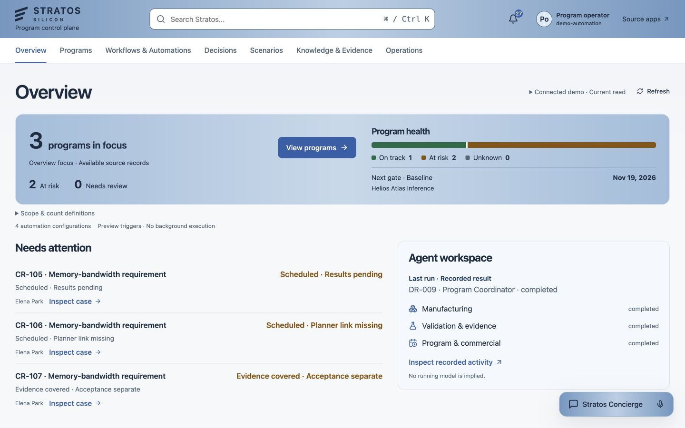

## Helios Program

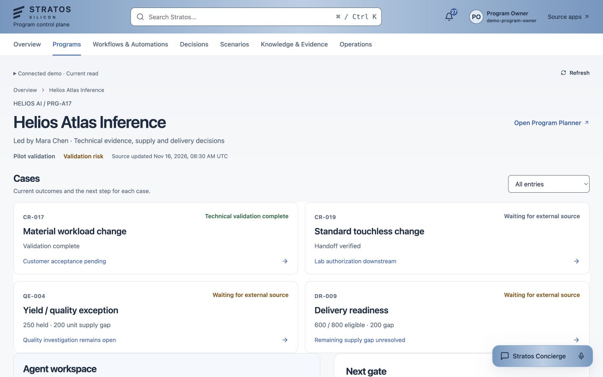

## CR-017

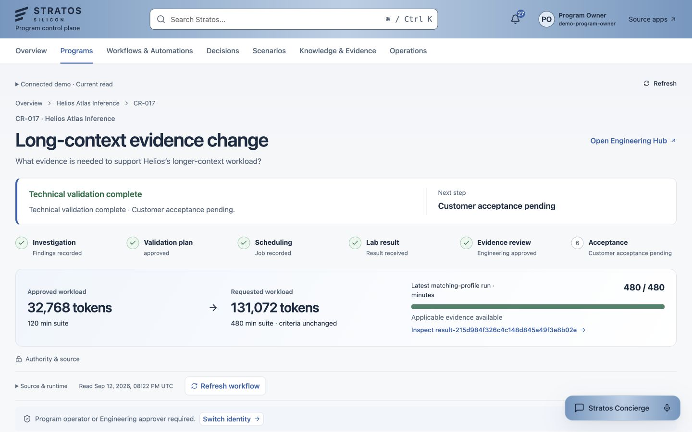

## CR-019

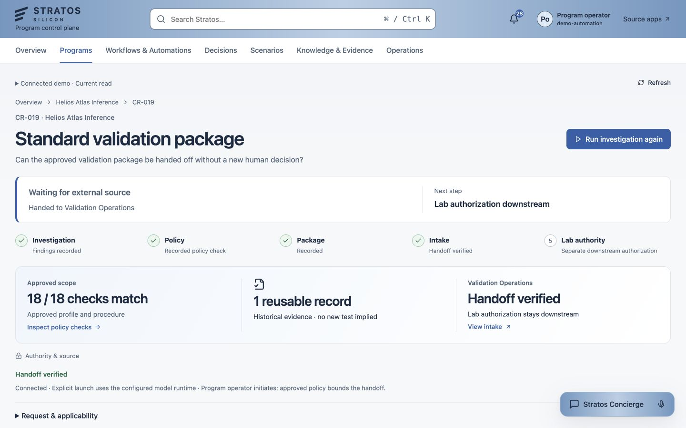

## QE-004

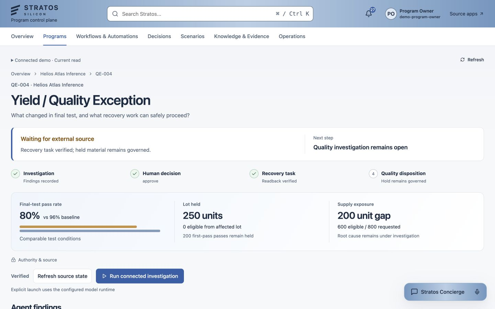

## DR-009

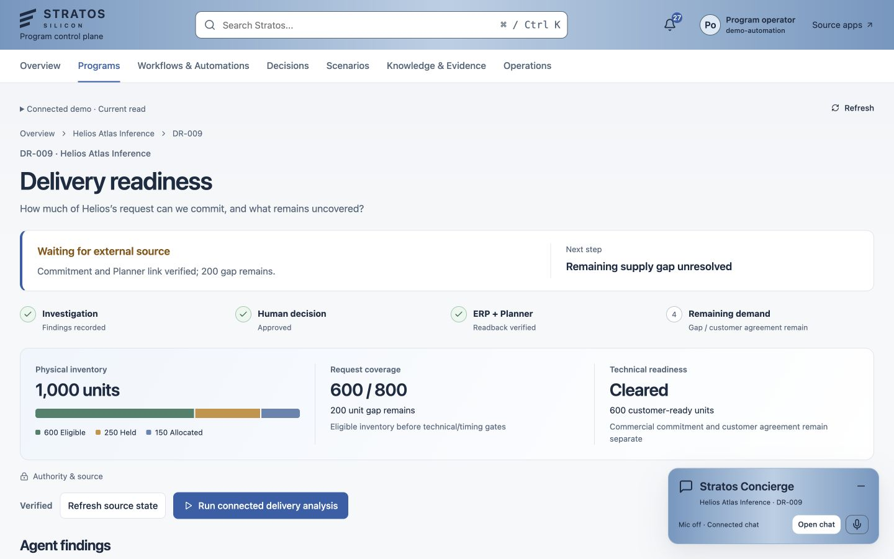

## Decision

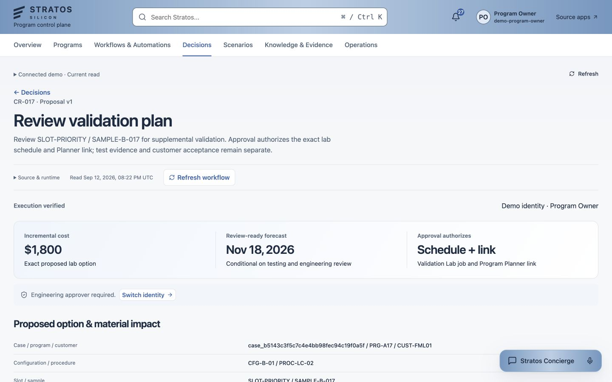

## Workflows

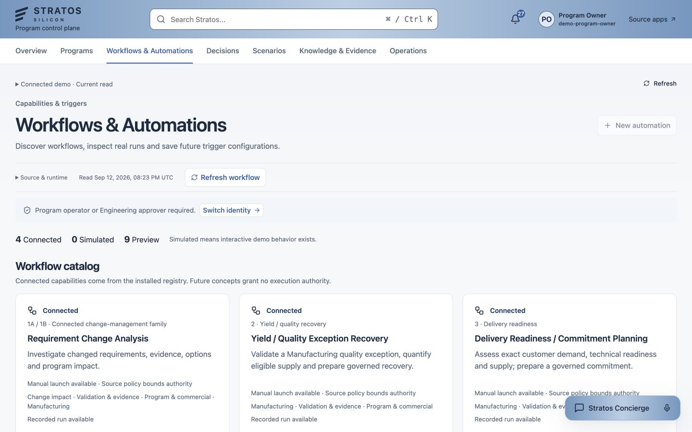

## Concierge

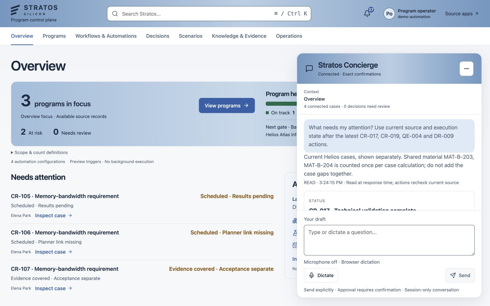

## Operations

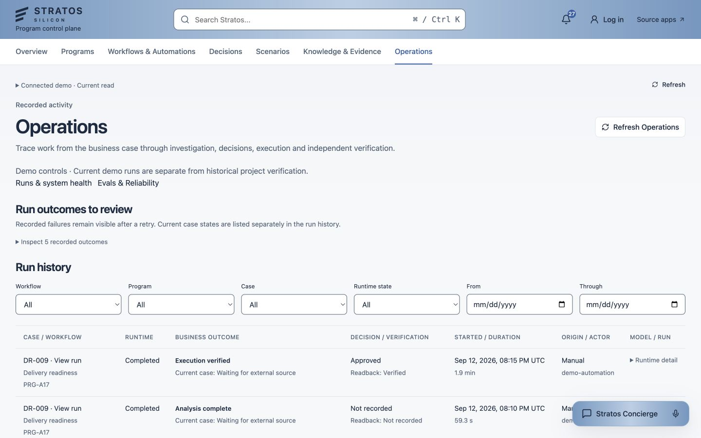

## Source evidence dialog

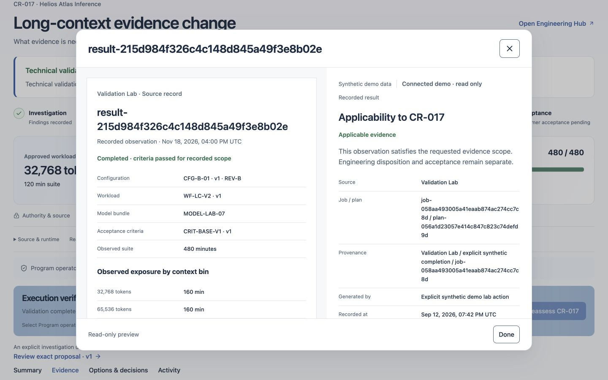

