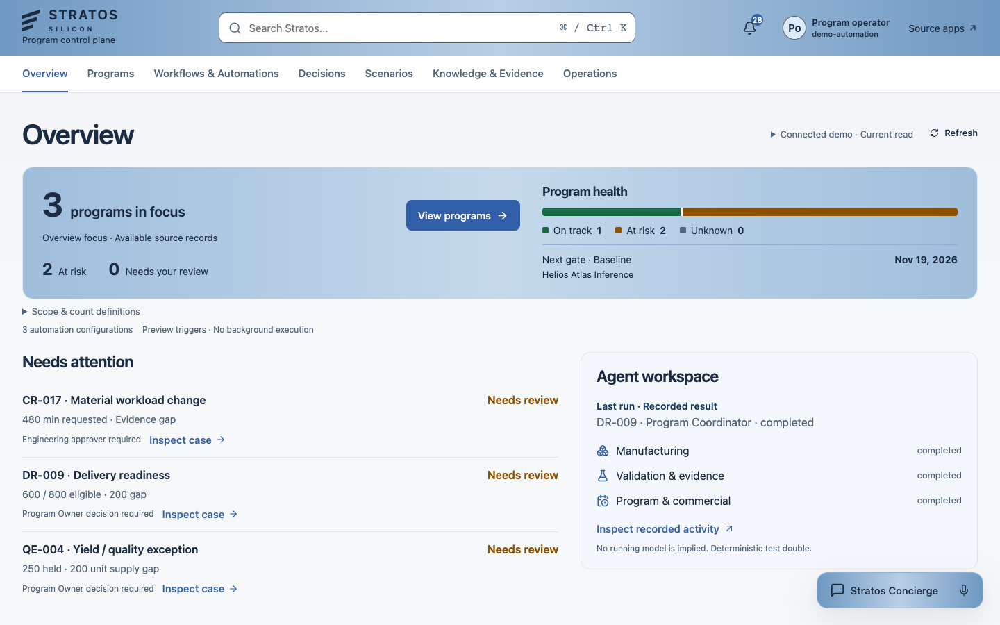
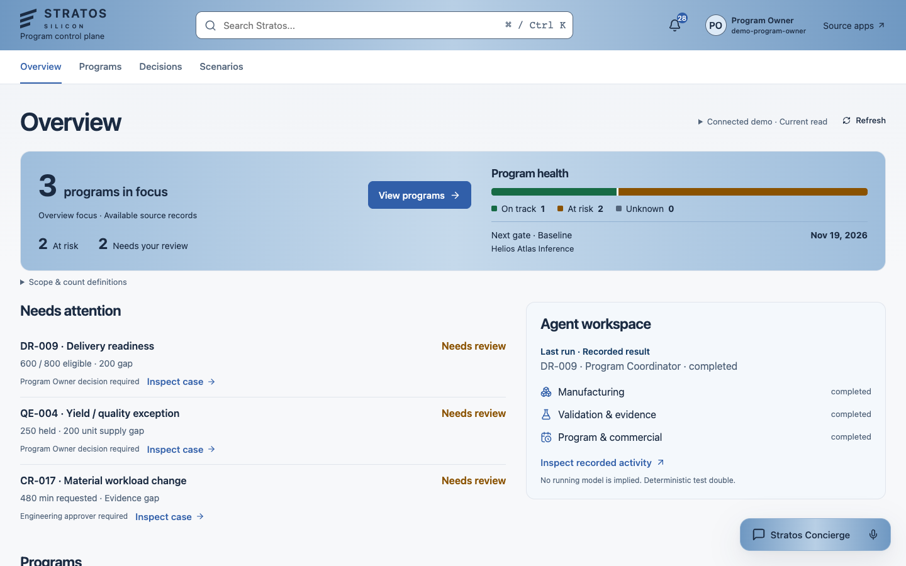
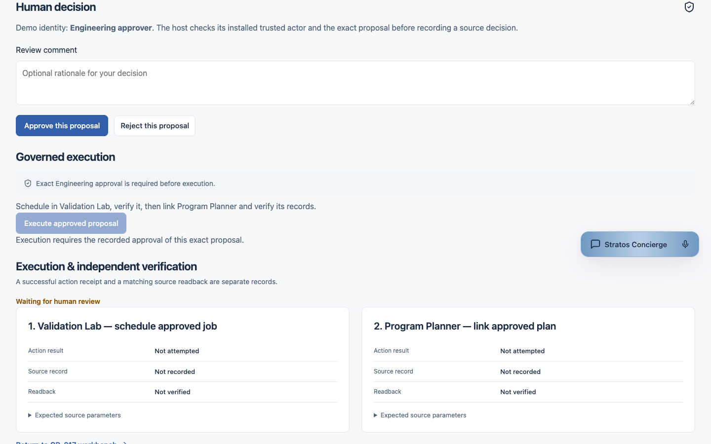
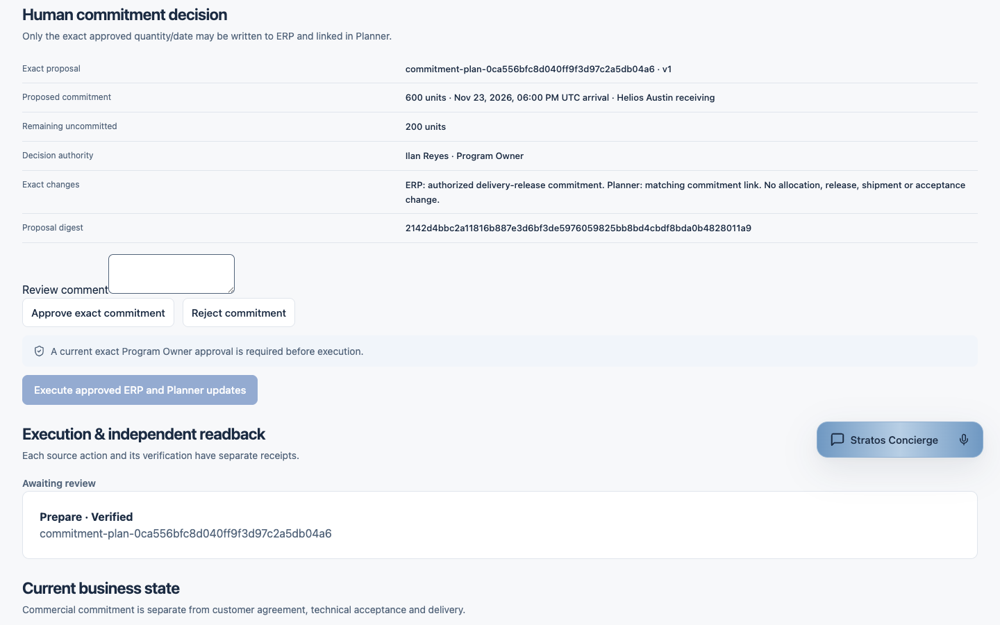

# Phase 10.1 visual review

Captured from the real local browser with isolated deterministic source/host data. These are scripted integration tests, not a paid AI run or an actual human approval. The four investigations were prepared by deterministic doubles; all three human proposals remain pending. Screenshots were visually inspected. Navigation and overflow were also checked at 1280×800.

## Program operator

## Engineering approver

## Program Owner

## Read-only viewer

The same three-program health mix and authoritative case facts appear in every Overview. Needs your review is 0 / 1 / 2 / 0 in this fixture. Program Owner's two reviewable business cases move first; no count is invented for operator/viewer.

## Exact engineering decision

## Exact delivery commitment decision

Approval and execution remain separate. The execution controls are disabled pending the exact recorded approval. Other personas do not receive these approval controls. Full authority and scope limits are documented in the [capability contract](../../PHASE10_1_PERSONA_ACCESS.md).
